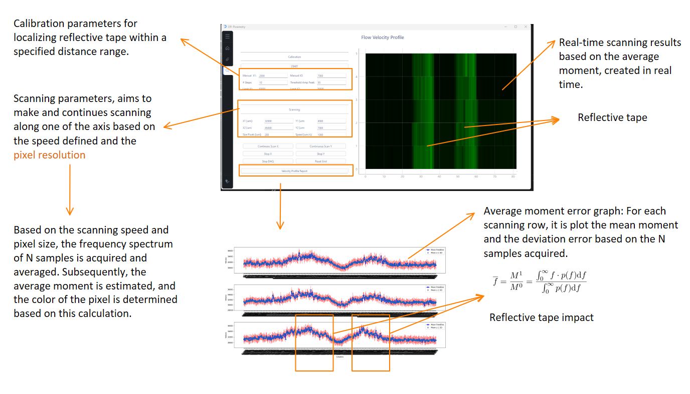

# **Velocity profile analysis in microfluidic chips through OFI**

  

This project focuses on developing a framework to perform microfluidic experiments using an Optical Feedback Interferometry (OFI) sensor. The repository includes a graphical user interface (GUI) designed for automating various devices involved in the experiments. It handles signal acquisition, laser alignment to the microfluidic channel, and fully automated scanning to interrogate the microchannels.


## **Features**
- **Real-time signal acquisition** with multi-threaded processing for faster performance
- **Visualization of velocity profiles** during real-time scanning of microchannels
- **Customizable OFI signal parameters** including acquisition frequency, sample points, and bandpass filtering
- **Automated scanning** with customizable parameters like scanning speed [µm/s] and pixel resolution [µm]
- **Data logging** with the average weighted momemtum average and frequency spectrum analysis of multiple samples captured along the experiment


Example:
   

Example Image of the Experimental Setup:
   [Experimental Setup](docs/images/experimental_setup.png)

Example Velocity Profile Output:
   [Velocity Profile](docs/images/velocity_profile.png)


## **Setup and Installation**
1. **Clone the repository:**
    ```bash
    git clone https://github.com/SSierraAl/SMI-ParticleSegmentation.git
    ```

2. **Create a virtual environment:**
    ```bash
    python3 -m venv venv
    source venv/bin/activate   # On Windows, use `venv\Scripts\activate`
    ```
3. **Usage:**
    ```bash
    cd GlobalGUI
    python main.py 
    ```
    


## **Contributing**

Contributions are welcome! If you would like to contribute to this project, please follow these steps:

1. Fork the repository.
2. Create a new branch: `git checkout -b feature-name`.
3. Make your changes and commit them: `git commit -m 'Add new feature'`.
4. Push to the branch: `git push origin feature-name`.
5. Open a pull request.

## **License**

This project is licensed under the MIT License - see the [LICENSE](LICENSE) file for details.

## **Contact**

For any questions or issues, please contact:

- **[Sebastian Sierra]** - [sebsieal@hotmail.com]
- **GitHub Issues:** Open an issue on the repository
